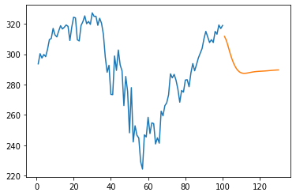

# Stock-Market-Forecasting

<h3> Stock market prediction is the act of trying to determine the future value of a company stock or other financial instrument traded on an exchange. The successful prediction of a stock's future price could yield significant profit. </h3> 
<h3> Stock market plays a key role in economical and social organization of a country. Stock market forecasting is highly demanding and most challenging task for investors, professional analyst and researchers in the financial market. </h3>

* In this project, I tried to forecast the stock market for **upcoming 30 days** by building a model using Keras.
* All the necessary data pre-processing steps were done before building the model.
* **_MinMaxScaler_** was used to normalize the data between 0 and 1.
* For building the model, the **_mean-squared-error_** loss function and the **_Adam_** optimizer were used with Keras.
* To evaluate the performance of the model, **_Root Mean Squared Error(RMSE)_** was used. We are getting a **_RMSE_** value of 0.0312.

 <h4> The forecasting for upcoming 30 days is shown as below. </h4>
 
 

_**Thank you!!**_
